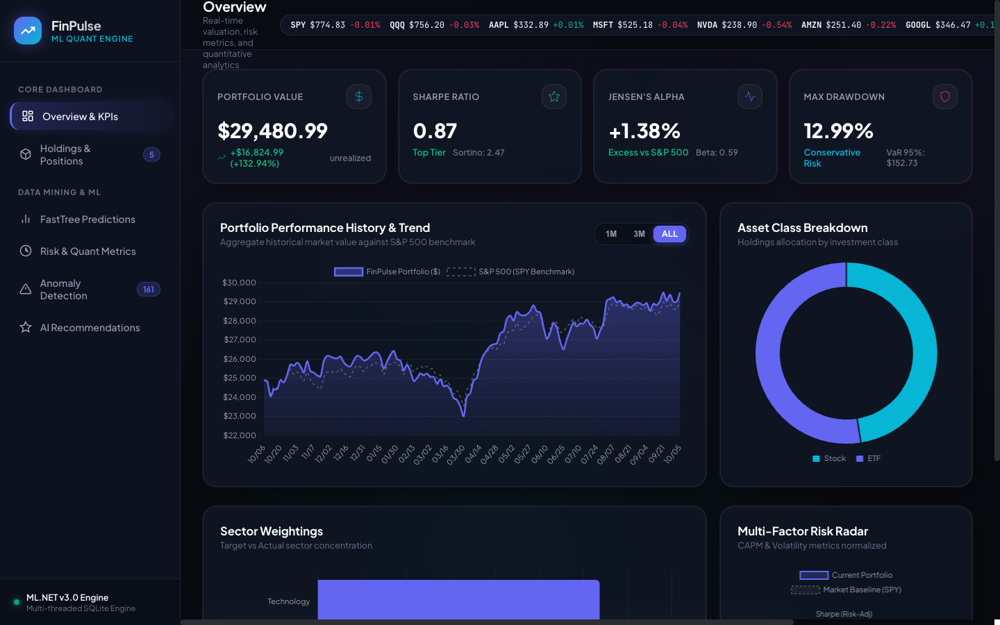

# 📈 Financial Portfolio Tracker

A production-quality C# / ML.NET and real-time Web application that tracks investments, analyses portfolio performance using quantitative risk metrics, and generates ML-driven investment recommendations — with live NYSE/NASDAQ feeds, interactive dark-mode dashboard, and SQLite persistence.

🚀 **[Live Web Dashboard](https://sharanteja-ctrl.github.io/FinancialPortfolioTracker/)**



---

## Architecture Overview

```
FinancialPortfolioTracker/
├── src/
│   ├── Core/
│   │   ├── Models/
│   │   │   ├── Investment.cs          ← Domain model (PnL, annualised return)
│   │   │   ├── Portfolio.cs           ← Aggregate root (allocations, totals)
│   │   │   ├── PortfolioAnalytics.cs  ← Risk/return metrics container
│   │   │   ├── StockPrice.cs          ← OHLCV + ML.NET input/output schemas
│   │   │   └── Recommendation.cs      ← ML recommendation model
│   │   ├── PortfolioAnalyzer.cs       ← Sharpe, Sortino, Beta, VaR, MaxDD …
│   │   └── RecommendationEngine.cs    ← Synthesises all ML signals → advice
│   ├── ML/
│   │   ├── PricePredictionEngine.cs   ← FastTree regression (next-day price)
│   │   ├── AnomalyDetectionEngine.cs  ← SrCNN spike & change-point detection
│   │   └── ClusteringEngine.cs        ← K-means behavioural clustering
│   ├── Data/
│   │   ├── DatabaseInitializer.cs     ← SQLite schema creation
│   │   ├── DataPreprocessor.cs        ← Multi-threaded CSV → features → DB
│   │   ├── Repositories/
│   │   │   ├── PortfolioRepository.cs ← CRUD for portfolios & investments
│   │   │   └── StockPriceRepository.cs← Bulk-insert + query for price data
│   │   ├── historical_prices.csv      ← Sample OHLCV data (AAPL/MSFT/GOOGL/AMZN/SPY)
│   │   └── sample_portfolio.csv       ← Sample portfolio seed file
│   ├── UI/
│   │   └── ConsoleUI.cs               ← Rich colour-coded console with bar charts
│   ├── Program.cs                     ← DI wiring + main menu loop
│   └── appsettings.json               ← Configuration (DB, ML paths, threading)
├── tests/
│   ├── InvestmentModelTests.cs        ← xUnit: PnL, returns
│   ├── PortfolioTests.cs              ← xUnit: allocations, totals
│   ├── DataPreprocessorTests.cs       ← xUnit: CSV parsing, multi-symbol
│   └── PortfolioAnalyzerTests.cs      ← xUnit: Sharpe, HHI (mocked repo)
├── scripts/
│   └── setup.sh                       ← Auto-install .NET + build + test
└── FinancialPortfolioTracker.sln
```

---

## Features

### Portfolio Management
| Feature | Detail |
|---|---|
| Add / remove investments | Stocks, ETFs, Bonds, Crypto, REITs, Mutual Funds |
| Real-time P&L | Unrealised gains, annualised return per holding |
| Allocation charts | By asset type and sector (ASCII bar charts) |
| NAV snapshots | Daily portfolio value history stored in SQLite |

### Risk & Return Analytics (MathNet.Numerics)
| Metric | Formula |
|---|---|
| Sharpe Ratio | (μ − rf) / σ × √252 |
| Sortino Ratio | (μ − rf) / σ_downside × √252 |
| Beta | Cov(port, bench) / Var(bench) |
| Jensen's Alpha | r − [rf + β(rm − rf)] |
| Treynor Ratio | (r − rf) / β |
| Information Ratio | (μ_port − μ_bench) / TE × √252 |
| Value at Risk (95%) | μ + 1.645σ (parametric) |
| Max Drawdown | Peak-to-trough over history |
| HHI | Σ(wi²) — portfolio concentration |

### ML.NET Models
| Model | Algorithm | Purpose |
|---|---|---|
| Price Prediction | FastTree Regression | Next-day close price |
| Spike Detection | SSA (SrCNN) | Unusual price movements |
| Change-Point | SSA Change-Point | Trend regime shifts |
| Clustering | K-Means | Behavioural grouping of holdings |

### Technical Indicators (DataPreprocessor)
- Moving Averages: MA5, MA20, MA50
- RSI (14-period)
- MACD (12/26/9 EMA)
- ATR (14-period)
- Bollinger Bands (20, ±2σ)
- Volume MA20, Price/MA20 ratio

### Multi-threading
- `Parallel.ForEachAsync` for per-symbol feature engineering
- `SemaphoreSlim` for controlled concurrent DB writes
- `ParallelOptions.MaxDegreeOfParallelism` configurable via `appsettings.json`
- `ConcurrentBag<T>` for thread-safe result collection

---

## Prerequisites

- **.NET 8 SDK** — [Download](https://dotnet.microsoft.com/download/dotnet/8)
- **Git** (optional, for version control)
- **Visual Studio 2022** or **VS Code with C# extension** (optional IDE)

---

## Quick Start

### Option A — Automated Setup Script (macOS/Linux)
```bash
cd FinancialPortfolioTracker
bash scripts/setup.sh
cd src && dotnet run
```

### Option B — Manual Steps
```bash
# 1. Install .NET 8 (if not already installed)
#    https://dotnet.microsoft.com/download/dotnet/8

# 2. Restore & Build
dotnet restore FinancialPortfolioTracker.sln
dotnet build   FinancialPortfolioTracker.sln -c Release

# 3. Run Tests
dotnet test tests/FinancialPortfolioTracker.Tests.csproj -c Release

# 4. Run the Application
cd src
dotnet run
```

### Option C — Visual Studio
1. Open `FinancialPortfolioTracker.sln`
2. Set `FinancialPortfolioTracker` as startup project
3. Press **F5**

---

## First-Run Walkthrough

```
1 → View Portfolio Summary         (empty initially)
4 → Load Historical Data (CSV)     (loads Data/historical_prices.csv)
2 → Add Investment                 (add AAPL, MSFT, GOOGL etc.)
3 → Update Prices from DB          (pulls latest close from loaded data)
5 → Train ML Models                (trains FastTree per symbol)
6 → Run Full Analysis              (Sharpe, Beta, VaR etc.)
7 → View Recommendations           (ML buy/sell/hold signals)
8 → Anomaly Detection              (spike & change-point scan)
9 → Cluster Analysis               (behavioural grouping)
```

---

## Configuration (`appsettings.json`)

```json
{
  "Database":    { "ConnectionString": "Data Source=portfolio_tracker.db" },
  "ML":          { "ModelSavePath": "Models/", "MinimumTrainingRows": 100 },
  "Portfolio":   { "RiskFreeRate": 0.05, "BenchmarkSymbol": "SPY" },
  "Processing":  { "MaxThreads": 8, "BatchSize": 1000 }
}
```

---

## CSV Data Format

The application accepts standard OHLCV CSV files with a header row:

```
Symbol,Date,Open,High,Low,Close,Volume
AAPL,2023-01-03,130.28,130.90,124.17,125.07,112117500
```

- **Symbol** and **Date** + **Close** are the minimum required columns
- **Open, High, Low, Volume** are optional (defaulted to Close/0 if missing)
- Multiple symbols can be in the same file

---

## Running Tests

```bash
dotnet test tests/ --logger "console;verbosity=normal"
```

Test coverage includes:
- Investment domain model (PnL, returns, annualised return)
- Portfolio aggregation (totals, allocations, HHI)
- DataPreprocessor (CSV parsing, outlier removal, bulk insert)
- PortfolioAnalyzer (Sharpe, HHI — with deterministic mock price series)

---

## Technology Stack

| Component | Technology |
|---|---|
| Language | C# 12 / .NET 8 |
| ML Framework | ML.NET 3.0.1 (FastTree, SSA, K-Means) |
| Database | SQLite via Microsoft.Data.Sqlite |
| ORM | Dapper |
| Statistics | MathNet.Numerics 5.0 |
| Logging | Microsoft.Extensions.Logging |
| Testing | xUnit + Moq |
| Configuration | Microsoft.Extensions.Configuration.Json |

---

## Git Workflow (Recommended)

```bash
git init
git add .
git commit -m "Initial commit: Financial Portfolio Tracker"

# Feature branches
git checkout -b feature/real-time-prices
git checkout -b feature/web-dashboard
```

---

## Extending the Project

| Extension | Guidance |
|---|---|
| Real-time prices | Integrate Alpha Vantage / Yahoo Finance REST API |
| Web dashboard | Add ASP.NET Core Blazor front-end |
| More ML models | Add `LightGBM` trainer for better accuracy |
| SQL Server | Change connection string + swap `Microsoft.Data.Sqlite` for `System.Data.SqlClient` |
| Notifications | Add email/Slack alerts on high-severity anomalies |
| Portfolio optimisation | Implement Markowitz mean-variance optimisation using MathNet |
